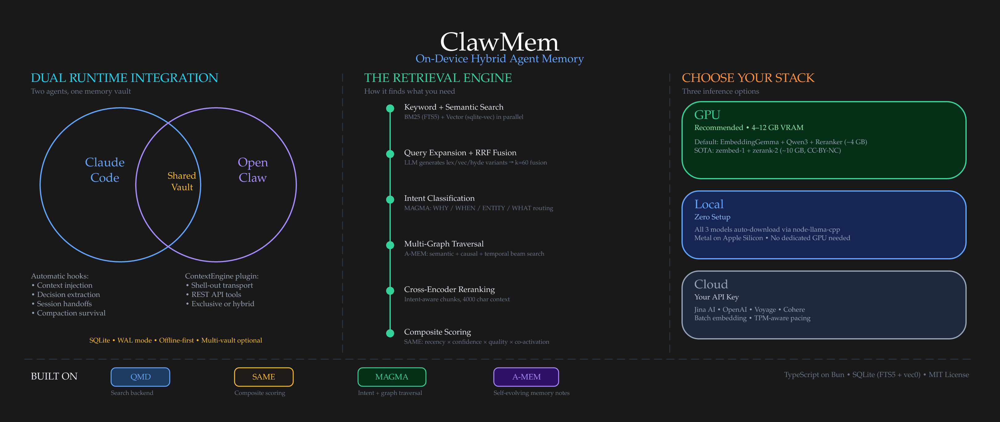

# ClawMem — Context engine for Claude Code and OpenClaw agents

<p align="center">
  
</p>

**On-device memory for Claude Code and AI agents.** Retrieval-augmented search, hooks, and an MCP server in a single local system. No API keys, no cloud dependencies.

ClawMem fuses recent research into a retrieval-augmented memory layer that agents actually use. The hybrid architecture combines [QMD](https://github.com/tobi/qmd)-derived multi-signal retrieval (BM25 + vector search + reciprocal rank fusion + query expansion + cross-encoder reranking), [SAME](https://github.com/sgx-labs/statelessagent)-inspired composite scoring (recency decay, confidence, content-type half-lives, co-activation reinforcement), [MAGMA](https://arxiv.org/abs/2501.13956)-style intent classification with multi-graph traversal (semantic, temporal, and causal beam search), and [A-MEM](https://arxiv.org/abs/2510.02178) self-evolving memory notes that enrich documents with keywords, tags, and causal links between entries. Pattern extraction from [Engram](https://github.com/Gentleman-Programming/engram) adds deduplication windows, frequency-based durability scoring, and temporal navigation.

Two integration paths: Claude Code hooks paired with an MCP server, or a native OpenClaw ContextEngine plugin. Both write to the same local SQLite vault. A decision captured during a Claude Code session shows up immediately when an OpenClaw agent picks up the same project.

TypeScript on Bun. MIT License.

## What It Does

ClawMem turns your markdown notes, project docs, and research dumps into persistent memory for AI coding agents. It automatically:

- **Surfaces relevant context** on every prompt (context-surfacing hook)
- **Bootstraps sessions** with your profile, latest handoff, recent decisions, and stale notes
- **Captures decisions** from session transcripts using a local GGUF observer model
- **Generates handoffs** at session end so the next session can pick up where you left off
- **Learns what matters** via a feedback loop that boosts referenced notes and decays unused ones
- **Guards against prompt injection** in surfaced content
- **Classifies query intent** (WHY / WHEN / ENTITY / WHAT) to weight search strategies
- **Traverses multi-graphs** (semantic, temporal, causal) via adaptive beam search
- **Evolves memory metadata** as new documents create or refine connections
- **Infers causal relationships** between facts extracted from session observations
- **Detects contradictions** between new and prior decisions, auto-decaying superseded ones
- **Scores document quality** using structure, keywords, and metadata richness signals
- **Boosts co-accessed documents** — notes frequently surfaced together get retrieval reinforcement
- **Decomposes complex queries** into typed retrieval clauses (BM25/vector/graph) for multi-topic questions
- **Cleans stale embeddings** automatically before embed runs, removing orphans from deleted/changed documents
- **Transaction-safe indexing** — crash mid-index leaves zero partial state (atomic commit with rollback)
- **Deduplicates hook-generated observations** within a 30-minute window using normalized content hashing, preventing memory bloat from repeated hook output
- **Navigates temporal neighborhoods** around any document via the `timeline` tool — progressive disclosure from search to chronological context to full content
- **Boosts frequently-revised memories** — documents with higher revision counts get a durability signal in composite scoring (capped at 10%)
- **Supports pin/snooze lifecycle** for persistent boosts and temporary suppression
- **Manages document lifecycle** — policy-driven archival sweeps with restore capability
- **Auto-routes queries** via `memory_retrieve` — classifies intent and dispatches to the optimal search backend
- **Syncs project issues** from Beads issue trackers into searchable memory

Runs fully local with no API keys and no cloud services. Integrates via Claude Code hooks and MCP tools, or as an OpenClaw ContextEngine plugin. Both modes share the same vault for cross-runtime memory. Works with any MCP-compatible client.

## Architecture

<p align="center">
  
</p>

## Install

### Platform Support

| Platform | Status | Notes |
|---|---|---|
| **Linux** | Full support | Primary target. systemd services for watcher + embed timer. |
| **macOS** | Full support | Homebrew SQLite handled automatically. GPU via Metal (llama.cpp). |
| **Windows (WSL2)** | Full support | Recommended for Windows users. Install Bun + ClawMem inside WSL2. |
| **Windows (native)** | Not recommended | Bun and sqlite-vec work, but `bin/clawmem` wrapper is bash, hooks expect bash commands, and systemd services have no equivalent. Use WSL2 instead. |

### Prerequisites

**Required:**

- [Bun](https://bun.sh) v1.0+ — runtime for ClawMem
- SQLite with FTS5 — included with Bun. On macOS, install `brew install sqlite` for extension loading support (ClawMem detects and uses Homebrew SQLite automatically).

**Optional (for better performance):**

- [llama.cpp](https://github.com/ggml-org/llama.cpp) (`llama-server`) — for dedicated GPU inference. Without it, `node-llama-cpp` runs models in-process (auto-downloads on first use). GPU servers give better throughput and prevent silent CPU fallback.
- systemd (Linux) or launchd (macOS) — for persistent background services (watcher, embed timer, GPU servers). ClawMem ships systemd unit templates; macOS users can create equivalent launchd plists. See [systemd services](docs/guides/systemd-services.md).

**Optional integrations:**

- [Claude Code](https://docs.anthropic.com/en/docs/claude-code) — for hooks + MCP integration
- [OpenClaw](https://github.com/openclawai/openclaw) — for ContextEngine plugin integration
- [bd CLI](https://github.com/dolthub/dolt) v0.58.0+ — for Beads issue tracker sync (only if using Beads)

### Install from npm (recommended)

```bash
npm install -g clawmem
```

If you use Bun as your package manager:

```bash
bun add -g clawmem
```

### Install from source

```bash
git clone https://github.com/yoloshii/clawmem.git ~/clawmem
cd ~/clawmem && bun install
ln -sf ~/clawmem/bin/clawmem ~/.bun/bin/clawmem
```

### Setup roadmap

After installing, here's the full journey from zero to working memory:

| Step | What | How | Details |
|------|------|-----|---------|
| **1. Bootstrap** | Create a vault, index your first collection, embed, install hooks and MCP | `clawmem bootstrap ~/notes --name notes` | One command does it all. Or run each step manually (see below). |
| **2. Choose models** | Pick embedding + reranker models based on your hardware | 12GB+ VRAM → SOTA stack (zembed-1 + zerank-2). Less → QMD native combo. No GPU → cloud embedding or CPU fallback. | [GPU Services](#gpu-services) |
| **3. Download models** | Get the GGUF files for your chosen stack | `wget` from HuggingFace, or let `node-llama-cpp` auto-download the QMD native models on first use | [Embedding](#embedding), [LLM Server](#llm-server), [Reranker Server](#reranker-server) |
| **4. Start services** | Run GPU servers (if using dedicated GPU) and background services | `llama-server` for each model. systemd units for watcher + embed timer. | [systemd services](docs/guides/systemd-services.md) |
| **5. Decide what to index** | Add collections for your projects, notes, research, and domain docs | `clawmem collection add ~/project --name project` | The more relevant markdown you index, the better retrieval works. See [building a rich context field](docs/introduction.md#building-a-rich-context-field). |
| **6. Connect your agent** | Hook into Claude Code, OpenClaw, or any MCP client | `clawmem setup hooks && clawmem setup mcp` for Claude Code. `clawmem setup openclaw` for OpenClaw. | [Integration](#integration) |
| **7. Verify** | Confirm everything is working | `clawmem doctor` (full health check) or `clawmem status` (quick index stats) | [Verify Installation](#verify-installation) |

**Fastest path:** Step 1 alone gets you a working system with in-process CPU/GPU inference and default models — no manual model downloads or service configuration needed. Steps 2-4 are optional upgrades for better performance. Steps 5-6 are where you customize what gets indexed and how your agent connects.

**Customize what gets indexed:** Each collection has a `pattern` field in `~/.config/clawmem/config.yaml` (default: `**/*.md`). Tailor it per collection — index project docs, research notes, decision records, Obsidian vaults, or anything else your agents should know about. The more relevant content in the vault, the better retrieval works. See the [quickstart](docs/quickstart.md#customize-index-patterns) for config examples.

### Quick start commands

```bash
# One command: init + index + embed + hooks + MCP
clawmem bootstrap ~/notes --name notes

# Or step by step:
clawmem init
clawmem collection add ~/notes --name notes
clawmem update --embed
clawmem setup hooks
clawmem setup mcp

# Add more collections (the more you index, the richer retrieval gets)
clawmem collection add ~/projects/myapp --name myapp
clawmem collection add ~/research --name research
clawmem update --embed

# Verify
clawmem doctor
```

### Integration

#### Claude Code

ClawMem integrates via hooks (`settings.json`) and an MCP stdio server. Hooks handle 90% of retrieval automatically - the agent never needs to call tools for routine context.

```bash
clawmem setup hooks    # Install lifecycle hooks (SessionStart, UserPromptSubmit, Stop, PreCompact)
clawmem setup mcp      # Register MCP server in ~/.claude.json (20+ agent tools)
```

**Automatic (90%):** `context-surfacing` injects relevant memory on every prompt. `postcompact-inject` re-injects state after compaction. `decision-extractor`, `handoff-generator`, `feedback-loop` capture session state on stop.

**Agent-initiated (10%):** MCP tools (`query`, `intent_search`, `find_causal_links`, `timeline`, etc.) for targeted retrieval when hooks don't surface what's needed.

#### OpenClaw

ClawMem registers as a native ContextEngine plugin - OpenClaw's pluggable interface for context management. Same 90/10 automatic retrieval, delivered through OpenClaw's lifecycle system instead of Claude Code hooks.

```bash
clawmem setup openclaw   # Shows installation steps
```

**What the plugin provides:**
- **`before_prompt_build` hook** - prompt-aware retrieval (context-surfacing + session-bootstrap)
- **`ContextEngine.afterTurn()`** - decision extraction, handoff generation, feedback loop
- **`ContextEngine.compact()`** - pre-compaction state preservation, delegates real compaction to legacy engine
- **5 agent tools** - `clawmem_search`, `clawmem_get`, `clawmem_session_log`, `clawmem_timeline`, `clawmem_similar`
- **Session lifecycle hooks** - `session_start`, `session_end`, `before_reset` safety net

Disable OpenClaw's native memory and `memory-lancedb` auto-recall/capture to avoid duplicate injection:
```bash
openclaw config set agents.defaults.memorySearch.extraPaths "[]"
```

**Alternative:** You can also use the Claude Code-style hooks + MCP approach with OpenClaw (`clawmem setup hooks && clawmem setup mcp`). This works but bypasses OpenClaw's ContextEngine lifecycle - you lose token budget awareness, native compaction orchestration, and the `afterTurn()` message pipeline. The ContextEngine plugin is recommended for new OpenClaw setups.

#### Dual-Mode Operation

Both integrations share the same SQLite vault by default. Claude Code and OpenClaw can run simultaneously - decisions captured in one runtime are immediately available in the other, giving agents persistent shared memory across sessions and platforms. WAL mode + busy_timeout handles concurrent access.

#### Multi-Vault (Optional)

By default, ClawMem uses a single vault at `~/.cache/clawmem/index.sqlite`. For users who want separate memory domains (e.g., work vs personal, or isolated vaults per project), ClawMem supports named vaults.

**Configure in `~/.config/clawmem/config.yaml`:**

```yaml
vaults:
  work: ~/.cache/clawmem/work.sqlite
  personal: ~/.cache/clawmem/personal.sqlite
```

**Or via environment variable:**

```bash
export CLAWMEM_VAULTS='{"work":"~/.cache/clawmem/work.sqlite","personal":"~/.cache/clawmem/personal.sqlite"}'
```

**Using vaults with MCP tools:**

All retrieval tools (`memory_retrieve`, `query`, `search`, `vsearch`, `intent_search`) accept an optional `vault` parameter. Omit it to use the default vault.

```
# Search the default vault (no vault param needed)
query("authentication flow")

# Search a named vault
query("project timeline", vault="work")

# List configured vaults
list_vaults()

# Sync content into a vault
vault_sync(vault="work", content_root="~/work/docs")
```

**Single-vault users:** No action needed. Everything works without configuration. The `vault` parameter is always optional and ignored when no vaults are configured.

### GPU Services

ClawMem uses three `llama-server` (llama.cpp) instances for neural inference. All three have in-process fallbacks via `node-llama-cpp` (auto-downloads on first use), so ClawMem works without a dedicated GPU. `node-llama-cpp` auto-detects the best available backend — Metal on Apple Silicon, Vulkan where available, CPU as last resort. With GPU acceleration (Metal/Vulkan), in-process inference is fast for these small models (0.3B–1.7B); on CPU-only systems it is significantly slower. For production use, run the servers via [systemd services](docs/guides/systemd-services.md) to prevent silent fallback.

**GPU with VRAM to spare (12GB+, recommended):** ZeroEntropy's distillation-paired stack delivers best retrieval quality — total ~10GB VRAM.

| Service | Port | Model | VRAM | Purpose |
|---|---|---|---|---|
| Embedding | 8088 | [zembed-1-Q4_K_M](https://huggingface.co/Abhiray/zembed-1-Q4_K_M-GGUF) | ~4.4GB | SOTA embedding (2560d, 32K context). Distilled from zerank-2 via zELO. |
| LLM | 8089 | [qmd-query-expansion-1.7B-q4_k_m](https://huggingface.co/tobil/qmd-query-expansion-1.7B-gguf) | ~2.2GB | Intent classification, query expansion, A-MEM |
| Reranker | 8090 | [zerank-2-Q4_K_M](https://huggingface.co/keisuke-miyako/zerank-2-gguf-q4_k_m) | ~3.3GB | SOTA reranker. Outperforms Cohere rerank-3.5. Optimal pairing with zembed-1. |

**Important:** zembed-1 and zerank-2 use non-causal attention — `-ub` must equal `-b` on llama-server (e.g. `-b 2048 -ub 2048`). See [Reranker Server](#reranker-server) for details.

**License:** zembed-1 and zerank-2 are released under **CC-BY-NC-4.0** — non-commercial only. The QMD native models below have no such restriction.

**No dedicated GPU / GPU without VRAM to spare:** The QMD native combo — total ~4GB VRAM, also runs via `node-llama-cpp` (Metal on Apple Silicon, Vulkan where available, CPU as last resort). Fast with GPU acceleration; significantly slower on CPU-only.

| Service | Port | Model | VRAM | Purpose |
|---|---|---|---|---|
| Embedding | 8088 | [EmbeddingGemma-300M-Q8_0](https://huggingface.co/ggml-org/embeddinggemma-300M-GGUF) | ~400MB | Vector search, indexing, context-surfacing (768d, 2K context) |
| LLM | 8089 | [qmd-query-expansion-1.7B-q4_k_m](https://huggingface.co/tobil/qmd-query-expansion-1.7B-gguf) | ~2.2GB | Intent classification, query expansion, A-MEM |
| Reranker | 8090 | [qwen3-reranker-0.6B-Q8_0](https://huggingface.co/ggml-org/Qwen3-Reranker-0.6B-Q8_0-GGUF) | ~1.3GB | Cross-encoder reranking (query, intent_search) |

The `bin/clawmem` wrapper defaults to `localhost:8088/8089/8090`. If a server is unreachable, ClawMem silently falls back to in-process inference via `node-llama-cpp` (auto-downloads the QMD native models on first use, uses Metal/Vulkan/CPU depending on hardware). With GPU acceleration this is fast; on CPU-only it is significantly slower. ClawMem always works either way, but **if you're running dedicated GPU servers, use [systemd services](docs/guides/systemd-services.md) to ensure they stay up** — otherwise a crashed server silently degrades without warning.

To prevent silent fallback and fail fast instead, set `CLAWMEM_NO_LOCAL_MODELS=true`.

#### Remote GPU (optional)

If your GPU lives on a separate machine, point the env vars at it:

```bash
export CLAWMEM_EMBED_URL=http://gpu-host:8088
export CLAWMEM_LLM_URL=http://gpu-host:8089
export CLAWMEM_RERANK_URL=http://gpu-host:8090
```

For remote setups, set `CLAWMEM_NO_LOCAL_MODELS=true` to prevent `node-llama-cpp` from auto-downloading multi-GB model files if a server is unreachable.

#### No Dedicated GPU (in-process inference)

All three QMD native models run locally without a dedicated GPU. `node-llama-cpp` auto-downloads them on first use (~300MB embedding + ~1.1GB LLM + ~600MB reranker) and auto-detects the best backend — **Metal on Apple Silicon** (fast, uses integrated GPU), **Vulkan where available** (fast, uses discrete or integrated GPU), or **CPU as last resort** (significantly slower). With Metal or Vulkan, in-process inference handles these small models well; CPU-only is functional but noticeably slower.

Alternatively, use a [cloud embedding provider](#option-c-cloud-embedding-api) if you prefer not to run models locally.

### Embedding

ClawMem calls the OpenAI-compatible `/v1/embeddings` endpoint for all embedding operations. This works with local llama-server instances and cloud providers alike.

#### Option A: GPU with VRAM to spare (recommended)

Use [zembed-1-Q4_K_M](https://huggingface.co/Abhiray/zembed-1-Q4_K_M-GGUF) — SOTA retrieval quality, distilled from zerank-2 via [ZeroEntropy's zELO methodology](https://docs.zeroentropy.dev). **CC-BY-NC-4.0** — non-commercial only.

- Size: 2.4GB, Dimensions: 2560, VRAM: ~4.4GB, Context: 32K tokens

```bash
wget https://huggingface.co/Abhiray/zembed-1-Q4_K_M-GGUF/resolve/main/zembed-1-Q4_K_M.gguf

# -ub must match -b for non-causal attention
llama-server -m zembed-1-Q4_K_M.gguf \
  --embeddings --port 8088 --host 0.0.0.0 \
  -ngl 99 -c 8192 -b 2048 -ub 2048
```

#### Option B: No GPU / GPU without VRAM to spare

Use [EmbeddingGemma-300M-Q8_0](https://huggingface.co/ggml-org/embeddinggemma-300M-GGUF) — the QMD native embedding model. Only 300MB, runs on CPU or any GPU.

- Size: 314MB, Dimensions: 768, VRAM: ~400MB (or CPU), Context: 2048 tokens

```bash
wget https://huggingface.co/ggml-org/embeddinggemma-300M-GGUF/resolve/main/embeddinggemma-300M-Q8_0.gguf

# On GPU (add -ngl 99):
llama-server -m embeddinggemma-300M-Q8_0.gguf \
  --embeddings --port 8088 --host 0.0.0.0 \
  -ngl 99 -c 2048 --batch-size 2048

# On CPU (omit -ngl):
llama-server -m embeddinggemma-300M-Q8_0.gguf \
  --embeddings --port 8088 --host 0.0.0.0 \
  -c 2048 --batch-size 2048
```

For multilingual corpora, the SOTA zembed-1 (Option A) supports multilingual out of the box. For a lightweight alternative: [granite-embedding-278m-multilingual-Q6_K](https://huggingface.co/bartowski/granite-embedding-278m-multilingual-GGUF) (314MB, set `CLAWMEM_EMBED_MAX_CHARS=1100` due to 512-token context).

#### Option C: Cloud Embedding API

Alternatively, use a cloud embedding provider instead of running a local server. Any provider with an OpenAI-compatible `/v1/embeddings` endpoint works.

**Configuration:** Copy `.env.example` to `.env` and set your provider credentials:

```bash
cp .env.example .env
# Edit .env:
CLAWMEM_EMBED_URL=https://api.jina.ai
CLAWMEM_EMBED_API_KEY=jina_your-key-here
CLAWMEM_EMBED_MODEL=jina-embeddings-v5-text-small
```

Or export them in your shell. **Precedence:** shell environment > `.env` file > `bin/clawmem` wrapper defaults.

| Provider | `CLAWMEM_EMBED_URL` | `CLAWMEM_EMBED_MODEL` | Dimensions | Notes |
|---|---|---|---|---|
| Jina AI | `https://api.jina.ai` | `jina-embeddings-v5-text-small` | 1024 | 32K context, task-specific LoRA adapters |
| OpenAI | `https://api.openai.com` | `text-embedding-3-small` | 1536 | 8K context, Matryoshka dimensions via `CLAWMEM_EMBED_DIMENSIONS` |
| Voyage AI | `https://api.voyageai.com` | `voyage-4-large` | 1024 | 32K context |
| Cohere | `https://api.cohere.com` | `embed-v4.0` | 1024 | 128K context |

Cloud mode auto-detects your provider from the URL and sends the right parameters (Jina `task`, Voyage/Cohere `input_type`, OpenAI `dimensions`). Batch embedding (50 fragments/request), server-side truncation, adaptive TPM-aware pacing, and retry with jitter are all handled automatically. Set `CLAWMEM_EMBED_TPM_LIMIT` to match your provider tier (default: 100000). See [docs/guides/cloud-embedding.md](docs/guides/cloud-embedding.md) for full details.

**Note:** Cloud providers handle their own context window limits — ClawMem skips client-side truncation when an API key is set. Local llama-server truncates at `CLAWMEM_EMBED_MAX_CHARS` (default: 6000 chars).

#### Verify and embed

```bash
# Verify endpoint is reachable
curl $CLAWMEM_EMBED_URL/v1/embeddings \
  -H "Content-Type: application/json" \
  -H "Authorization: Bearer $CLAWMEM_EMBED_API_KEY" \
  -d "{\"input\":\"test\",\"model\":\"$CLAWMEM_EMBED_MODEL\"}"

# Embed your vault
./bin/clawmem embed
```

### LLM Server

Intent classification, query expansion, and A-MEM extraction use [qmd-query-expansion-1.7B](https://huggingface.co/tobil/qmd-query-expansion-1.7B-gguf) — a Qwen3-1.7B finetuned by QMD specifically for generating search expansion terms (hyde, lexical, and vector variants). ~1.1GB at q4_k_m quantization, served via `llama-server` on port 8089.

**Without a server:** If `CLAWMEM_LLM_URL` is unset, `node-llama-cpp` auto-downloads the model on first use.

**Performance (RTX 3090):**
- Intent classification: **27ms**
- Query expansion: **333 tok/s**
- VRAM: ~2.2-2.8GB depending on quantization

**Qwen3 /no_think flag:** Qwen3 uses thinking tokens by default. ClawMem appends `/no_think` to all prompts automatically to get structured output in the `content` field.

**Intent classification:** Uses a dual-path approach:
1. **Heuristic regex classifier** (instant) — handles strong signals (why/when/who keywords) with 0.8+ confidence
2. **LLM refinement** (27ms on GPU) — only for ambiguous queries below 0.8 confidence

**Server setup:**

```bash
# Download the finetuned model
wget https://huggingface.co/tobil/qmd-query-expansion-1.7B-gguf/resolve/main/qmd-query-expansion-1.7B-q4_k_m.gguf

# Start llama-server for LLM inference
llama-server -m qmd-query-expansion-1.7B-q4_k_m.gguf \
  --port 8089 --host 0.0.0.0 \
  -ngl 99 -c 4096 --batch-size 512
```

### Reranker Server

Cross-encoder reranking for `query` and `intent_search` pipelines on port 8090. ClawMem calls the `/v1/rerank` endpoint (or falls back to scoring via `/v1/completions` for compatible servers).

Scores each candidate against the original query (cross-encoder architecture). `query` pipeline: 4000 char context per doc (deep reranking); `intent_search`: 200 char context per doc (fast reranking).

**GPU with VRAM to spare (recommended):** [zerank-2-Q4_K_M](https://huggingface.co/keisuke-miyako/zerank-2-gguf-q4_k_m) (2.4GB, ~3.3GB VRAM). Outperforms Cohere rerank-3.5 and Gemini 2.5 Flash. Optimal pairing with zembed-1 (same distillation architecture via zELO). **CC-BY-NC-4.0** — non-commercial only.

```bash
wget https://huggingface.co/keisuke-miyako/zerank-2-gguf-q4_k_m/resolve/main/zerank-2-Q4_k_m.gguf

# -ub must match -b for non-causal attention
llama-server -m zerank-2-Q4_K_M.gguf \
  --reranking --port 8090 --host 0.0.0.0 \
  -ngl 99 -c 2048 -b 2048 -ub 2048
```

**CPU / GPU without VRAM to spare:** [qwen3-reranker-0.6B-Q8_0](https://huggingface.co/ggml-org/Qwen3-Reranker-0.6B-Q8_0-GGUF) (~600MB, ~1.3GB VRAM). The QMD native reranker — auto-downloaded by `node-llama-cpp` if no server is running.

```bash
wget https://huggingface.co/ggml-org/Qwen3-Reranker-0.6B-Q8_0-GGUF/resolve/main/Qwen3-Reranker-0.6B-Q8_0.gguf

llama-server -m Qwen3-Reranker-0.6B-Q8_0.gguf \
  --reranking --port 8090 --host 0.0.0.0 \
  -ngl 99 -c 2048 --batch-size 512
```

**Note:** zerank-2 and zembed-1 use non-causal attention — `-ub` (ubatch) must equal `-b` (batch). Omitting `-ub` or setting it lower causes assertion crashes. qwen3-reranker-0.6B does not have this requirement. See [llama.cpp#12836](https://github.com/ggml-org/llama.cpp/issues/12836).

### MCP Server

ClawMem exposes 26 MCP tools via the [Model Context Protocol](https://modelcontextprotocol.io) and an optional HTTP REST API. Any MCP-compatible client or HTTP client can use it.

**Claude Code (automatic):**

```bash
./bin/clawmem setup mcp   # Registers in ~/.claude.json
```

**Manual (any MCP client):**

Add to your MCP config (e.g. `~/.claude.json`, `claude_desktop_config.json`, or your client's equivalent):

```json
{
  "mcpServers": {
    "clawmem": {
      "command": "/absolute/path/to/clawmem/bin/clawmem",
      "args": ["mcp"]
    }
  }
}
```

The server runs via stdio — no network port needed. The `bin/clawmem` wrapper sets the GPU endpoint env vars automatically.

**Verify:** After registering, your client should see tools including `memory_retrieve`, `search`, `vsearch`, `query`, `query_plan`, `intent_search`, `timeline`, etc.

### HTTP REST API (optional)

For web dashboards, non-MCP agents, cross-machine access, or programmatic use:

```bash
./bin/clawmem serve                          # localhost:7438, no auth
./bin/clawmem serve --port 8080              # custom port
CLAWMEM_API_TOKEN=secret ./bin/clawmem serve # with bearer token auth
```

**Endpoints:**

| Method | Path | Description |
|---|---|---|
| GET | `/health` | Liveness probe + version + doc count |
| GET | `/stats` | Full index statistics |
| POST | `/search` | Unified search (`mode`: auto/keyword/semantic/hybrid) |
| POST | `/retrieve` | Smart retrieve with auto-routing (`mode`: auto/keyword/semantic/causal/timeline/hybrid) |
| GET | `/documents/:docid` | Single document by 6-char hash prefix |
| GET | `/documents?pattern=...` | Multi-get by glob pattern |
| GET | `/timeline/:docid` | Temporal neighborhood (before/after) |
| GET | `/sessions` | Recent session history |
| GET | `/collections` | List all collections |
| GET | `/lifecycle/status` | Active/archived/pinned/snoozed counts |
| POST | `/documents/:docid/pin` | Pin/unpin |
| POST | `/documents/:docid/snooze` | Snooze until date |
| POST | `/documents/:docid/forget` | Deactivate |
| POST | `/lifecycle/sweep` | Archive stale docs (dry_run default) |
| GET | `/graph/causal/:docid` | Causal chain traversal |
| GET | `/graph/similar/:docid` | k-NN neighbors |
| GET | `/export` | Full vault export as JSON |
| POST | `/reindex` | Trigger re-scan |
| POST | `/graphs/build` | Rebuild temporal + semantic graphs |

**Auth:** Set `CLAWMEM_API_TOKEN` env var to require `Authorization: Bearer <token>` on all requests. If unset, access is open (localhost-only by default). See `.env.example`.

**Search example:**

```bash
curl -X POST http://localhost:7438/search \
  -H 'Content-Type: application/json' \
  -d '{"query": "authentication decisions", "mode": "hybrid", "compact": true}'
```

### Verify Installation

```bash
./bin/clawmem doctor   # Full health check
./bin/clawmem status   # Quick index status
bun test               # Run test suite
```

## Agent Instructions

ClawMem ships three instruction files and an optional maintenance agent:

| File | Loaded | Purpose |
|------|--------|---------|
| `CLAUDE.md` | Automatically (Claude Code, when working in this repo) | Complete operational reference — hooks, tools, query optimization, scoring, pipeline details, troubleshooting |
| `AGENTS.md` | Framework-dependent | Identical to CLAUDE.md — cross-framework compatibility (Cursor, Windsurf, Codex, etc.) |
| `SKILL.md` | On-demand (agent reads when needed) | Same reference as CLAUDE.md, shipped with the package for cross-project use |
| `agents/clawmem-curator.md` | On-demand via `clawmem setup curator` | Maintenance agent — lifecycle triage, retrieval health checks, dedup sweeps, graph rebuilds |

**Working in the ClawMem repo:** No action needed — `CLAUDE.md` loads automatically.

**Using ClawMem from other projects:** Your agent needs instructions on how to use ClawMem's hooks and MCP tools. Two options:

### Option A: Copy instructions into your project

Copy the contents of `CLAUDE.md` (or the relevant sections) into your project's own `CLAUDE.md` or `AGENTS.md`. Simple but requires manual updates when ClawMem changes.

### Option B: Add a trigger block (recommended)

Add this minimal trigger block to your global `~/.claude/CLAUDE.md`. It gives the agent routing rules always loaded, and tells it how to find the full reference (SKILL.md) shipped with your installation when deeper guidance is needed:

```markdown
## ClawMem

Architecture: hooks (automatic, ~90%) + MCP tools (explicit, ~10%).

Vault: `~/.cache/clawmem/index.sqlite` | Config: `~/.config/clawmem/config.yaml`

### Escalation Gate (3 rules — ONLY escalate to MCP tools when one fires)

1. **Low-specificity injection** — `<vault-context>` is empty or lacks the specific fact needed
2. **Cross-session question** — "why did we decide X", "what changed since last time"
3. **Pre-irreversible check** — before destructive or hard-to-reverse changes

### Tool Routing (once escalated)

**Preferred:** `memory_retrieve(query)` — auto-classifies and routes to the optimal backend.

**Direct routing** (when calling specific tools):

    "why did we decide X"         → intent_search(query)          NOT query()
    "what happened last session"  → session_log()                 NOT query()
    "what else relates to X"      → find_similar(file)            NOT query()
    Complex multi-topic           → query_plan(query)             NOT query()
    General recall                → query(query, compact=true)
    Keyword spot check            → search(query, compact=true)
    Conceptual/fuzzy              → vsearch(query, compact=true)
    Full content                  → multi_get("path1,path2")
    Lifecycle health              → lifecycle_status()
    Stale sweep                   → lifecycle_sweep(dry_run=true)
    Restore archived              → lifecycle_restore(query)

ALWAYS `compact=true` first → review → `multi_get` for full content.

### Proactive Use (no escalation gate needed)

- User says "remember this" / critical decision made → `memory_pin(query)` immediately
- User corrects a misconception → `memory_pin(query)` the correction
- `<vault-context>` surfaces irrelevant/noisy content → `memory_snooze(query, until)` for 30 days
- Need to correct a memory → `memory_forget(query)`
- After bulk ingestion → `build_graphs`

### Anti-Patterns

- Do NOT use `query()` for everything — match query type to tool, or use `memory_retrieve`
- Do NOT call query/intent_search every turn — 3 rules above are the only gates
- Do NOT re-search what's already in `<vault-context>`
- Do NOT pin everything — pin is for persistent high-priority items, not routine decisions
- Do NOT forget memories to "clean up" — let confidence decay handle it
- Do NOT wait for curator to pin decisions — pin immediately when critical

For detailed operational guidance (query optimization, troubleshooting, collection setup, embedding workflow, graph building, curator), find and read the shipped SKILL.md:
  Bash: CLAWMEM_ROOT=$(cd "$(dirname "$(which clawmem)")/.." && pwd) && echo "$CLAWMEM_ROOT/SKILL.md"
  Then: Read the file at that path.
```

This gives your agent the 3-rule gate, tool routing, and proactive behaviors always loaded. When it needs deeper guidance, it locates and reads the full SKILL.md reference shipped with your installation — no symlinks or skill registration required.

---

## CLI Reference

```
clawmem init                                    Create DB + config
clawmem bootstrap <vault> [--name N] [--skip-embed]  One-command setup
clawmem collection add <path> --name <name>     Add a collection
clawmem collection list                         List collections
clawmem collection remove <name>                Remove a collection

clawmem update [--pull] [--embed]               Incremental re-scan
clawmem embed [-f]                              Generate fragment embeddings
clawmem reindex [--force]                       Full re-index
clawmem watch                                   File watcher daemon

clawmem search <query> [-n N] [--json]          BM25 keyword search
clawmem vsearch <query> [-n N] [--json]         Vector semantic search
clawmem query <query> [-n N] [--json]           Full hybrid pipeline

clawmem profile                                 Show user profile
clawmem profile rebuild                         Force profile rebuild
clawmem update-context                          Regenerate per-folder CLAUDE.md

clawmem budget [--session ID]                   Token utilization
clawmem log [--last N]                          Session history
clawmem hook <name>                             Manual hook trigger
clawmem surface --context --stdin               IO6: pre-prompt context injection
clawmem surface --bootstrap --stdin             IO6: per-session bootstrap injection

clawmem reflect [N]                             Cross-session reflection (last N days, default 14)
clawmem consolidate [--dry-run] [N]             Find and archive duplicate low-confidence docs

clawmem install-service [--enable] [--remove]   Systemd watcher service
clawmem setup hooks [--remove]                  Install/remove Claude Code hooks
clawmem setup mcp [--remove]                    Register/remove MCP server
clawmem setup curator [--remove]                Install/remove curator maintenance agent
clawmem mcp                                     Start stdio MCP server
clawmem serve [--port 7438] [--host 127.0.0.1]  Start HTTP REST API server
clawmem path                                    Print database path
clawmem doctor                                  Full health check
clawmem status                                  Quick index status
```

## MCP Tools (25)

Registered by `clawmem setup mcp`. Available to any MCP-compatible client.

| Tool | Description |
|---|---|
| `__IMPORTANT` | Workflow guide: prefer `memory_retrieve` → match query type to tool → `multi_get` for full content |

### Core Search & Retrieval

| Tool | Description |
|---|---|
| `memory_retrieve` | **Preferred entry point.** Auto-classifies query and routes to optimal backend (query, intent_search, session_log, find_similar, or query_plan). Use instead of manually choosing a search tool. |
| `search` | BM25 keyword search — for exact terms, config names, error codes, filenames. Composite scoring + co-activation boost + compact mode. Collection filter supports comma-separated values. Prefer `memory_retrieve` for auto-routing. |
| `vsearch` | Vector semantic search — for conceptual/fuzzy matching when exact keywords are unknown. Composite scoring + co-activation boost + compact mode. Collection filter supports comma-separated values. Prefer `memory_retrieve` for auto-routing. |
| `query` | Full hybrid pipeline (BM25 + vector + rerank) — general-purpose when query type is unclear. WRONG for "why" questions (use `intent_search`) or cross-session queries (use `session_log`). Prefer `memory_retrieve` for auto-routing. Intent hint, strong-signal bypass, chunk dedup, candidateLimit, MMR diversity, compact mode. |
| `get` | Retrieve single document by path or docid |
| `multi_get` | Retrieve multiple docs by glob or comma-separated list |
| `find_similar` | USE THIS for "what else relates to X", "show me similar docs". Finds k-NN vector neighbors — discovers connections beyond keyword overlap that search/query cannot find. |

### Intent-Aware Search

| Tool | Description |
|---|---|
| `intent_search` | USE THIS for "why did we decide X", "what caused Y", "who worked on Z". Classifies intent (WHY/WHEN/ENTITY/WHAT), traverses causal + semantic graph edges. Returns decision chains that `query()` cannot find. |
| `query_plan` | USE THIS for complex multi-topic queries ("tell me about X and also Y", "compare A with B"). Decomposes into parallel typed clauses (bm25/vector/graph), executes each, merges via RRF. `query()` searches as one blob — this tool splits topics and routes each optimally. |

**`intent_search` pipeline:** Query → Intent Classification → BM25 + Vector → Intent-Weighted RRF → Graph Expansion (WHY/ENTITY intents) → Cross-Encoder Reranking → Composite Scoring

**`query_plan` pipeline:** Query → LLM decomposition into 2-4 typed clauses → Parallel execution (BM25/vector/graph per clause) → RRF merge across clauses → Composite scoring. Falls back to single-query for simple inputs.

### Multi-Graph & Causal

| Tool | Description |
|---|---|
| `build_graphs` | Build temporal and/or semantic graphs from document corpus |
| `find_causal_links` | Trace decision chains: "what led to X", "how we got from A to B". Follow up `intent_search` with this tool on a top result to walk the full causal chain. Traverses causes / caused_by / both up to N hops with depth-annotated reasoning. |
| `memory_evolution_status` | Show how a document's A-MEM metadata evolved over time |
| `timeline` | Show the temporal neighborhood around a document — what was created/modified before and after it. Progressive disclosure: search → timeline (context) → get (full content). Supports same-collection scoping and session correlation. |

### Beads Integration

| Tool | Description |
|---|---|
| `beads_sync` | Sync Beads issues from Dolt backend (`bd` CLI) into memory: creates docs, bridges all dep types to `memory_relations`, runs A-MEM enrichment |

### Memory Management & Lifecycle

| Tool | Description |
|---|---|
| `memory_forget` | Search → deactivate closest match (with audit trail) |
| `memory_pin` | Pin a memory for +0.3 composite boost. USE PROACTIVELY when: user states a persistent constraint, makes an architecture decision, or corrects a misconception. Don't wait for curator — pin critical decisions immediately. |
| `memory_snooze` | Temporarily hide a memory from context surfacing until a date. USE PROACTIVELY when `<vault-context>` repeatedly surfaces irrelevant content — snooze for 30 days instead of ignoring it. |
| `status` | Index health with content type distribution |
| `reindex` | Trigger vault re-scan |
| `index_stats` | Detailed stats: types, staleness, access counts, sessions |
| `session_log` | USE THIS for "last time", "yesterday", "what happened", "what did we do". Returns session history with handoffs and file changes. DO NOT use `query()` for cross-session questions — this tool has session-specific data that search cannot find. |
| `profile` | Current static + dynamic user profile |
| `lifecycle_status` | Document lifecycle statistics: active, archived, forgotten, pinned, snoozed counts and policy summary |
| `lifecycle_sweep` | Run lifecycle policies: archive stale docs past retention threshold, optionally purge old archives. Defaults to dry_run (preview only) |
| `lifecycle_restore` | Restore documents that were auto-archived by lifecycle policies. Filter by query, collection, or restore all |

### Compact Mode

`search`, `vsearch`, and `query` accept `compact: true` to return `{ id, path, title, score, snippet, content_type, fragment }` instead of full content. Saves ~5x tokens for initial filtering.

## Hooks (Claude Code Integration)

Hooks installed by `clawmem setup hooks`:

| Hook | Event | What It Does |
|---|---|---|
| `context-surfacing` | UserPromptSubmit | Hybrid search → FTS supplement → file-aware search (E13) → snooze filter → spreading activation (E11) → memory type diversification (E10) → tiered injection (HOT/WARM/COLD) → `<vault-context>` + `<vault-routing>` hint. Profile-driven budget/results/timeout. |
| `postcompact-inject` | SessionStart | Re-injects authoritative context after compaction: precompact state + recent decisions + antipatterns + vault context (1200 token budget) |
| `curator-nudge` | SessionStart | Surfaces curator report actions, nudges when report is stale (>7 days) |
| `precompact-extract` | PreCompact | Extracts decisions, file paths, open questions before auto-compaction → writes `precompact-state.md` to auto-memory |
| `decision-extractor` | Stop | GGUF observer extracts structured decisions, infers causal links, detects contradictions with prior decisions |
| `handoff-generator` | Stop | GGUF observer generates rich handoff, regex fallback |
| `feedback-loop` | Stop | Silently boosts referenced notes, decays unused ones, records co-activation + usage relations between co-referenced docs, tracks utility signals (surfaced vs referenced ratio for lifecycle automation) |

Additional hooks available but not installed by default:

| Hook | Event | Why Not Default |
|---|---|---|
| `session-bootstrap` | SessionStart | Injects ~2000 tokens before user types anything. `context-surfacing` on first prompt is more precise. |
| `staleness-check` | SessionStart | Redundant without `session-bootstrap` (stale notes are part of its output). |
| `pretool-inject` | PreToolUse | Disabled in HOOK_EVENT_MAP (cannot inject additionalContext via PreToolUse). |

Hooks handle ~90% of retrieval automatically. For agent escalation logic (when to use MCP tools vs rely on hooks), see `CLAUDE.md`.

## Search Pipeline

```
User Query + optional intent hint
  → BM25 Probe → Strong Signal Check (skip expansion if top hit ≥ 0.85 with gap ≥ 0.15; disabled when intent provided)
  → Query Expansion (intent steers LLM prompt when provided)
  → BM25 + Vector Search (parallel, original query 2× weight)
  → Reciprocal Rank Fusion → slice to candidateLimit (default 30)
  → Intent-Aware Chunk Selection (intent terms at 0.5× weight alongside query terms at 1.0×)
  → Cross-Encoder Reranking (4000 char context; intent prepended; chunk dedup; batch cap=4)
  → Position-Aware Blending (α=0.75 top3, 0.60 mid, 0.40 tail)
  → SAME Composite Scoring ((search × 0.5 + recency × 0.25 + confidence × 0.25) × qualityMultiplier × lengthNorm × coActivationBoost + pinBoost)
  → MMR Diversity Filter (Jaccard bigram similarity > 0.6 → demoted)
  → Ranked Results
```

For agent-facing query optimization (tool selection, query string quality, intent parameter, candidateLimit), see `CLAUDE.md`.

### Multi-Graph Traversal

For WHY and ENTITY queries, the search pipeline expands results through the memory graph:

1. Start from top-10 baseline results as anchor nodes
2. For each frontier node: get neighbors via any relation type
3. Score transitions: `λ1·structure + λ2·semantic_affinity`
4. Apply decay: `new_score = parent_score * γ + transition_score`
5. Keep top-k (beam search), repeat until max depth or budget

**Graph types:**
- **Semantic** — vector similarity edges (threshold > 0.7)
- **Temporal** — chronological document ordering
- **Causal** — LLM-inferred cause→effect from Observer facts + Beads `blocks`/`waits-for` deps
- **Supporting** — LLM-analyzed document relationships + Beads `discovered-from` deps
- **Contradicts** — LLM-analyzed document relationships

### Content Type Scoring

| Type | Half-life | Baseline | Notes |
|---|---|---|---|
| `decision` | ∞ | 0.85 | Never decays |
| `hub` | ∞ | 0.80 | Never decays |
| `research` | 90 days | 0.70 | |
| `project` | 120 days | 0.65 | |
| `handoff` | 30 days | 0.60 | Fast decay — most recent matters |
| `progress` | 45 days | 0.50 | |
| `note` | 60 days | 0.50 | Default |
| `antipattern` | ∞ | 0.75 | Never decays — accumulated negative patterns persist |

Content types are inferred from frontmatter or file path patterns. Half-lives extend up to 3× for frequently-accessed memories (access reinforcement, decays over 90 days). Non-durable types (handoff, progress, note, project) lose 5% confidence per week without access (attention decay). Decision/hub/research/antipattern are exempt.

**Quality scoring:** Each document gets a `quality_score` (0.0–1.0) computed during indexing based on length, structure (headings, lists), decision/correction keywords, and frontmatter richness. Applied as `qualityMultiplier = 0.7 + 0.6 × qualityScore` (range: 0.7× penalty to 1.3× boost).

**Length normalization:** `1/(1 + 0.5 × log2(max(bodyLength/500, 1)))` — penalizes verbose entries that dominate via keyword density. Floor at 30% of original score.

**Frequency boost:** Documents with higher revision counts or duplicate counts get a durability signal: `freqSignal = (revisions - 1) × 2 + (duplicates - 1)`, `freqBoost = min(0.10, log1p(freqSignal) × 0.03)`. Revision count (content evolution) is weighted 2× vs duplicate count (ingest repetition). Capped at 10%.

**Pin boost:** Pinned documents get +0.3 additive boost (capped at 1.0). Use `memory_pin` to pin critical memories.

**Snooze:** Snoozed documents are filtered out of context surfacing until their snooze date. Use `memory_snooze` for temporary suppression.

**Contradiction detection:** When `decision-extractor` identifies a new decision that contradicts a prior one, the old decision's confidence is automatically lowered (−0.25 for contradictions, −0.15 for updates). Superseded decisions naturally fade from context surfacing without manual intervention.

## Features

### A-MEM (Adaptive Memory Evolution)

Documents are automatically enriched with structured metadata when indexed:
- **Keywords** (3-7 specific terms)
- **Tags** (3-5 broad categories)
- **Context** (1-2 sentence description)

When new documents create links, neighboring documents' metadata evolves — keywords merge, context updates, and the evolution history is tracked with version numbers and reasoning.

### Causal Inference

The decision-extractor hook analyzes Observer facts for causal relationships. When multiple facts exist in an observation, an LLM identifies cause→effect pairs (confidence ≥ 0.6). Causal chains can be queried via `find_causal_links` with multi-hop traversal using recursive CTEs.

### Beads Integration

Projects using [Beads](https://github.com/steveyegge/beads) (v0.58.0+, Dolt backend) issue tracking are fully integrated into the MAGMA memory graph:

- **Auto-sync**: Watcher detects `.beads/` directory changes → `syncBeadsIssues()` queries `bd` CLI for live Dolt data → creates markdown docs in `beads` collection
- **Dependency bridging**: All Beads dependency types map to `memory_relations` edges — `blocks`/`conditional-blocks`/`waits-for`/`caused-by`→causal, `discovered-from`/`supersedes`/`duplicates`→supporting, `relates-to`/`related`/`parent-child`→semantic. Tagged `{origin: "beads"}` for traceability.
- **A-MEM enrichment**: New beads docs get full `postIndexEnrich()` — memory note construction, semantic/entity link generation, memory evolution
- **Graph traversal**: `intent_search` and `find_causal_links` traverse beads dependency edges alongside observation-inferred causal chains
- **Requirement**: `bd` binary on PATH or at `~/go/bin/bd`

`beads_sync` MCP tool for manual sync; watcher handles routine operations automatically.

### Fragment-Level Embedding

Documents are split into semantic fragments (sections, lists, code blocks, frontmatter, facts) and each fragment gets its own vector embedding. Full-doc embedding is preserved for broad-match queries.

### Local Observer Agent

Uses the LLM server (shared with query expansion and intent classification) to extract structured observations from session transcripts: type, title, facts, narrative, concepts, files read/modified. Falls back to regex patterns if the model is unavailable.

### User Profile

Two-tier auto-curated profile extracted from your decisions and hub documents:
- **Static**: persistent facts (Levenshtein-deduplicated)
- **Dynamic**: recent session context

Injected at session start for instant personalization.

### Prompt Injection Filtering

Five detection layers protect injected content: legacy string patterns, role injection regex, instruction override patterns, delimiter injection, and unicode obfuscation detection. Filtered results are skipped entirely (no placeholder tokens wasted).

### Consolidation Worker

Optional background process that enriches documents missing A-MEM metadata. Runs on a configurable interval, processing 3 documents per tick. Non-blocking (Timer.unref).

### Per-Folder CLAUDE.md Generation

Automatically generates context sections in per-folder CLAUDE.md files from recent decisions and session activity related to that directory.

### Feedback Loop

Notes referenced by the agent during a session get boosted (`access_count++`). Unreferenced notes decay via recency. Over time, useful notes rise and noise fades.

## Feature Flags

| Variable | Default | Effect |
|---|---|---|
| `CLAWMEM_ENABLE_AMEM` | enabled | A-MEM note construction + link generation during indexing |
| `CLAWMEM_ENABLE_CONSOLIDATION` | disabled | Background worker for backlog A-MEM enrichment |
| `CLAWMEM_CONSOLIDATION_INTERVAL` | 300000 | Worker interval in ms (min 15000) |
| `CLAWMEM_EMBED_URL` | `http://localhost:8088` | Embedding server URL. Uses llama-server (GPU or CPU) or cloud API. Falls back to in-process `node-llama-cpp` if unset. |
| `CLAWMEM_EMBED_API_KEY` | (none) | API key for cloud embedding. Enables cloud mode: batch embedding, provider-specific params, TPM-aware pacing. |
| `CLAWMEM_EMBED_MODEL` | `embedding` | Model name for embedding requests. Override for cloud providers (e.g. `jina-embeddings-v5-text-small`). |
| `CLAWMEM_EMBED_TPM_LIMIT` | `100000` | Tokens-per-minute limit for cloud embedding pacing. Match to your provider tier. |
| `CLAWMEM_EMBED_DIMENSIONS` | (none) | Output dimensions for OpenAI `text-embedding-3-*` Matryoshka models (e.g. `512`, `1024`). |
| `CLAWMEM_LLM_URL` | `http://localhost:8089` | LLM server URL for intent/query/A-MEM. Without it, falls to `node-llama-cpp` (if allowed). |
| `CLAWMEM_RERANK_URL` | `http://localhost:8090` | Reranker server URL. Without it, falls to `node-llama-cpp` (if allowed). |
| `CLAWMEM_NO_LOCAL_MODELS` | `false` | Block `node-llama-cpp` from auto-downloading GGUF models. Set `true` for remote-only setups where you want fail-fast on unreachable endpoints. |

## Configuration

### Collection Config

`~/.config/clawmem/config.yaml`:

```yaml
collections:
  notes:
    path: /home/user/notes
    pattern: "**/*.md"
    autoEmbed: true
  docs:
    path: /home/user/docs
    pattern: "**/*.md"
    update: "git pull"
directoryContext: false  # opt-in per-folder CLAUDE.md generation
```

### Database

`~/.cache/clawmem/index.sqlite` — single SQLite file with FTS5 + sqlite-vec extensions.

### Frontmatter

Parsed via `gray-matter`. Supported fields:

```yaml
---
title: "Document Title"
tags: [tag1, tag2]
domain: "infrastructure"
workstream: "project-name"
content_type: "decision"   # decision|hub|research|project|handoff|progress|note
review_by: "2026-03-01"
---
```

## Suggested Memory Filesystem

This structure separates human-curated content from auto-generated memories, and within auto-generated content, separates **user memories** (persist across agents, owned by the human) from **agent memories** (operational, generated from sessions). Static knowledge lives in `resources/` with no recency decay, distinct from ephemeral session logs. The layout works with any MCP-compatible client (Claude Code, OpenClaw, custom agents).

### Workspace Collection

The primary workspace where the agent operates. Path varies by client (e.g., `~/workspace/`, `~/.openclaw/workspace/`, or any directory you choose).

```
<workspace>/                         ← Collection: "workspace"
├── MEMORY.md                        # Human-curated long-term memory
├── memory/                          # Session logs (daily entries)
│   ├── 2026-02-05.md
│   └── 2026-02-06.md
├── resources/                       # Static knowledge — use content_type: hub (∞ half-life)
│   ├── runbooks/
│   │   └── deploy-checklist.md
│   └── onboarding.md
├── _clawmem/                        # Auto-generated — DO NOT EDIT
│   ├── user/                        #   User memories (persist across agents/sessions)
│   │   ├── profile.md               #     Static facts + dynamic context
│   │   ├── preferences/             #     Extracted preferences (update_existing merge policy)
│   │   └── entities/                #     Named entities (people, services, repos)
│   ├── agent/                       #   Agent memories (operational, session-derived)
│   │   ├── observations/            #     Decisions + observations from transcripts
│   │   ├── handoffs/                #     Session summaries with next steps
│   │   └── antipatterns/            #     Accumulated negative patterns (∞ half-life)
│   └── precompact-state.md          #   Pre-compaction snapshot (transient)
└── ...
```

### Project Collections

Each project gets its own collection. Same structure, with optional Beads integration.

```
~/Projects/<project>/               ← Collection: "<project>"
├── .beads/                          # Beads issue tracker (Dolt backend, auto-synced)
│   └── dolt/                        #   Dolt SQL database (source of truth)
├── MEMORY.md                        # Human-curated project memory
├── memory/                          # Project session logs
│   └── 2026-02-06.md
├── resources/                       # Static project knowledge (∞ half-life)
│   ├── architecture.md
│   └── api-reference.md
├── research/                        # Research dumps (fragment-embedded, 90-day decay)
│   └── 2026-02-06-topic-slug.md
├── _clawmem/                        # Auto-generated per-project
│   ├── user/
│   │   └── preferences/
│   ├── agent/
│   │   ├── observations/
│   │   ├── handoffs/
│   │   ├── antipatterns/
│   │   └── beads/                   #   Beads issues as searchable markdown
│   └── precompact-state.md
├── CLAUDE.md
├── src/
└── README.md
```

### Design Principles

| Principle | Rationale | ClawMem Mechanism |
|---|---|---|
| **User/agent separation** | User memories (preferences, entities, profile) are owned by the human and persist indefinitely. Agent memories (observations, handoffs) are operational artifacts with lifecycle management. | `_clawmem/user/` vs `_clawmem/agent/` — different merge policies and decay rules per content type |
| **Resources are first-class** | Static knowledge (runbooks, architecture docs, API refs) should never lose relevance due to recency decay. | `resources/` indexed with `content_type: hub` → ∞ half-life in composite scoring |
| **Progressive disclosure** | Hook injection (2000 token budget) benefits from tiered loading: compact snippets first, full content on demand. | `compact=true` (L1) → `multi_get` (L2) at query time. Pre-computed abstracts not yet implemented — candidate for future L0 tier. |
| **Beads as memory edges** | Issue tracker data bridges into the knowledge graph via typed relations, not just as flat documents. | `syncBeadsIssues()` maps deps → `memory_relations`: blocks→causal, discovered-from→supporting, relates-to→semantic |
| **Merge policies per facet** | Different memory types need different deduplication strategies to prevent bloat. | `saveMemory()` dedup window (30min, normalized hash) + `getMergePolicy()`: decision→dedup_check (cosine>0.92), antipattern→merge_recent (7d), preference→update_existing, handoff→always_new |

### Layer Mapping

| Layer | Path | Owner | Decay | ClawMem Role |
|---|---|---|---|---|
| Long-Term Memory | `MEMORY.md` | Human | ∞ | Indexed, profile supplements, human-curated anchor |
| Session Logs | `memory/*.md` | Human | 60 days | Indexed, daily entries, handoff auto-generated |
| Static Resources | `resources/**/*.md` | Human | ∞ (hub) | Fragment-embedded, no recency penalty |
| Research | `research/*.md` | Human | 90 days | Fragment-embedded for granular retrieval |
| User Profile | `_clawmem/user/profile.md` | Auto | ∞ | Static facts + dynamic context |
| User Preferences | `_clawmem/user/preferences/*.md` | Auto | ∞ | Extracted preferences (update_existing merge) |
| User Entities | `_clawmem/user/entities/*.md` | Auto | ∞ | Named entities across sessions |
| Observations | `_clawmem/agent/observations/*.md` | Auto | ∞ (decision) | Decisions + observations from transcripts |
| Handoffs | `_clawmem/agent/handoffs/*.md` | Auto | 30 days | Session summaries with next steps |
| Antipatterns | `_clawmem/agent/antipatterns/*.md` | Auto | ∞ | Accumulated negative patterns |
| Beads | `_clawmem/agent/beads/*.md` | Auto | ∞ | Beads issues synced from Dolt, relations in memory graph |

Manual layers benefit from periodic re-indexing — a cron job running `clawmem update --embed` keeps the index fresh for content edited outside of watched directories.

### Setup

```bash
# Bootstrap workspace collection (use your agent's workspace path)
./bin/clawmem bootstrap ~/workspace --name workspace

# Bootstrap each project
./bin/clawmem bootstrap ~/Projects/my-project --name my-project

# Enable auto-embed for real-time indexing
# Edit ~/.config/clawmem/config.yaml → autoEmbed: true

# Install watcher as systemd service
./bin/clawmem install-service --enable
```

#### OpenClaw-Specific

```bash
# OpenClaw uses ~/.openclaw/workspace/ as its workspace root
./bin/clawmem bootstrap ~/.openclaw/workspace --name workspace
```

## Dependencies

| Package | Purpose |
|---|---|
| `@modelcontextprotocol/sdk` | MCP server |
| `gray-matter` | YAML frontmatter parsing |
| `node-llama-cpp` | GGUF model inference (reranking, query expansion, A-MEM) |
| `sqlite-vec` | Vector similarity extension |
| `yaml` | Config parsing |
| `zod` | MCP schema validation |

## Deployment

Three-tier retrieval architecture: infrastructure (watcher + embed timer) → hooks (~90%) → agent MCP (~10%). Works out of the box without a dedicated GPU (all models auto-download via `node-llama-cpp`, uses Metal on Apple Silicon). For best performance, run three `llama-server` instances — see [GPU Services](#gpu-services) for model tiers (SOTA vs QMD native) and [Cloud Embedding](#option-c-cloud-embedding-api) for cloud embedding alternatives.

Key services: `clawmem-watcher` (auto-index on file change + beads sync), `clawmem-embed` timer (daily embedding sweep), 9 Claude Code hooks (context injection, session bootstrap, decision extraction, handoffs, feedback, compaction support). Optional `clawmem-curator` agent for on-demand lifecycle triage, retrieval health checks, and maintenance (`clawmem setup curator`).

## Acknowledgments

Built on the shoulders of:

- [A-MEM](https://arxiv.org/abs/2510.02178) — self-evolving memory architecture
- [Beads](https://github.com/steveyegge/beads) — Dolt-backed issue tracker for AI agents
- [claude-mem](https://github.com/thedotmack/claude-mem) — Claude Code memory integration reference
- [Engram](https://github.com/Gentleman-Programming/engram) — observation dedup window, topic-key upsert pattern, temporal timeline navigation, duplicate metadata scoring signals
- [MAGMA](https://arxiv.org/abs/2501.13956) — multi-graph memory agent
- [memory-lancedb-pro](https://github.com/CortexReach/memory-lancedb-pro) — retrieval gate, length normalization, MMR diversity, access reinforcement algorithms
- [OpenViking](https://github.com/volcengine/OpenViking) — query decomposition patterns, collection-scoped retrieval, transaction-safe indexing
- [QMD](https://github.com/tobi/qmd) — search backend (BM25 + vectors + RRF + reranking)
- [SAME](https://github.com/sgx-labs/statelessagent) — agent memory concepts (recency decay, confidence scoring, session tracking)
- [supermemory](https://github.com/supermemoryai/clawdbot-supermemory) — hook patterns and context surfacing ideas

## License

MIT
